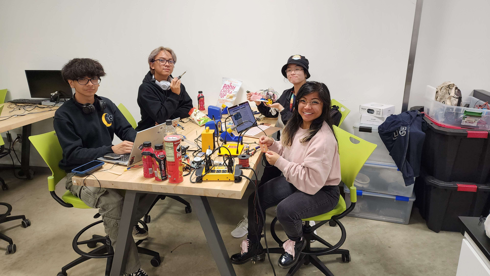
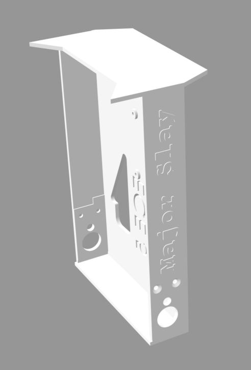
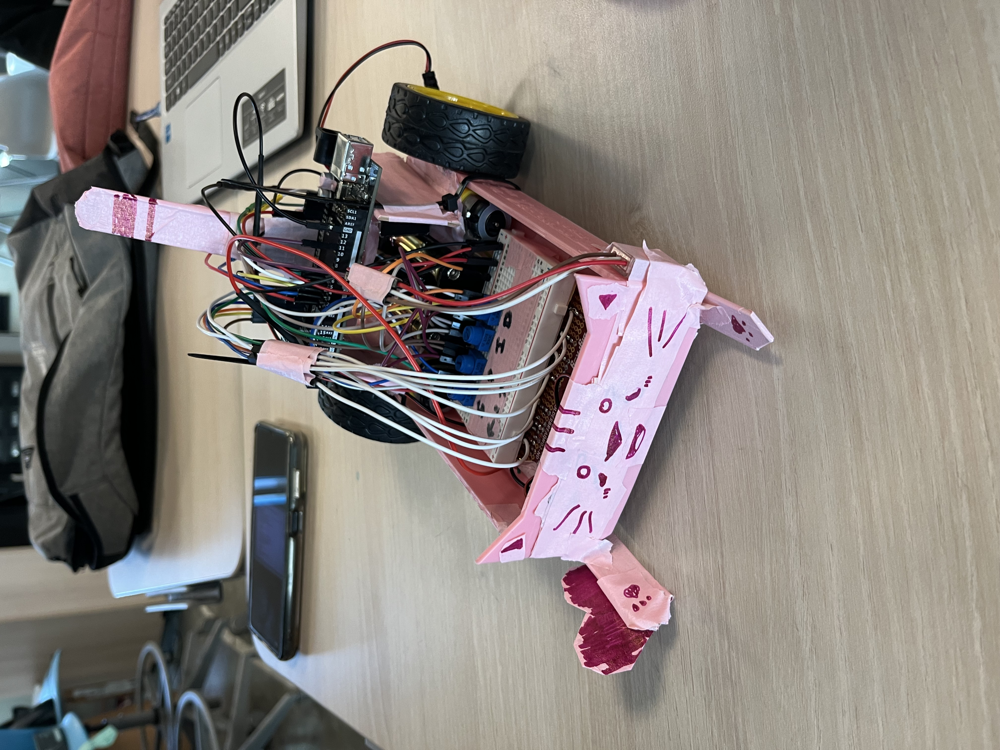
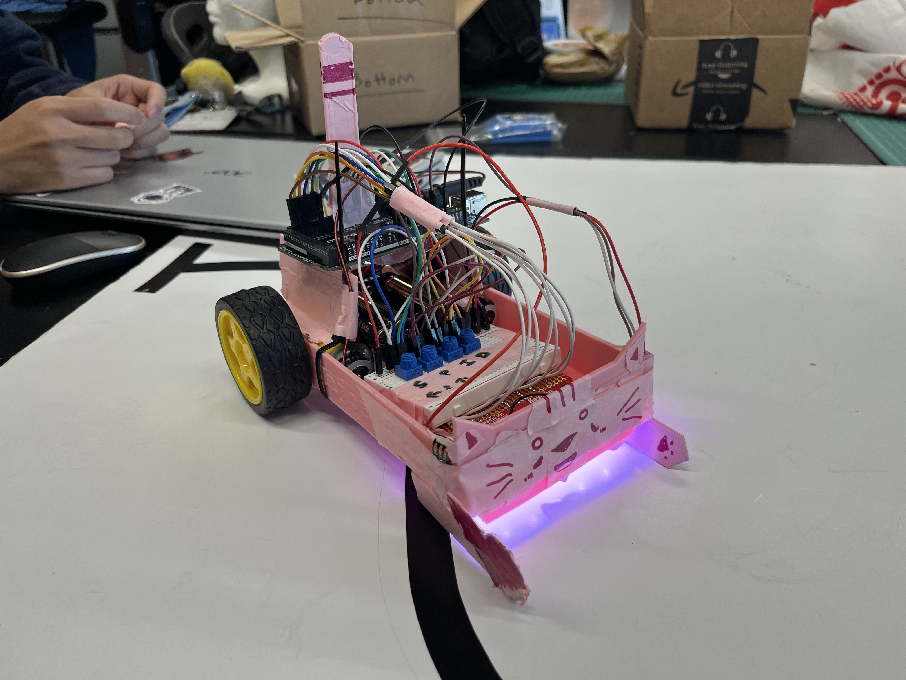
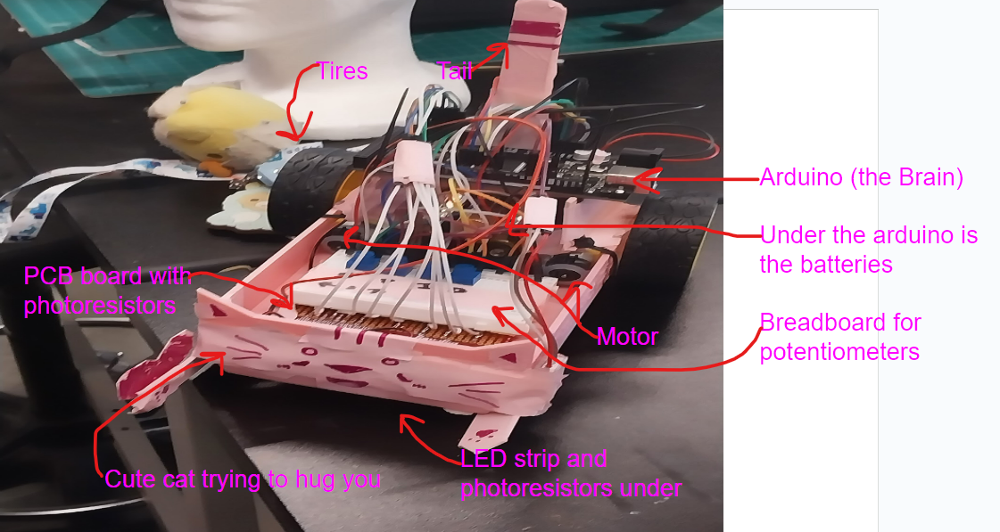
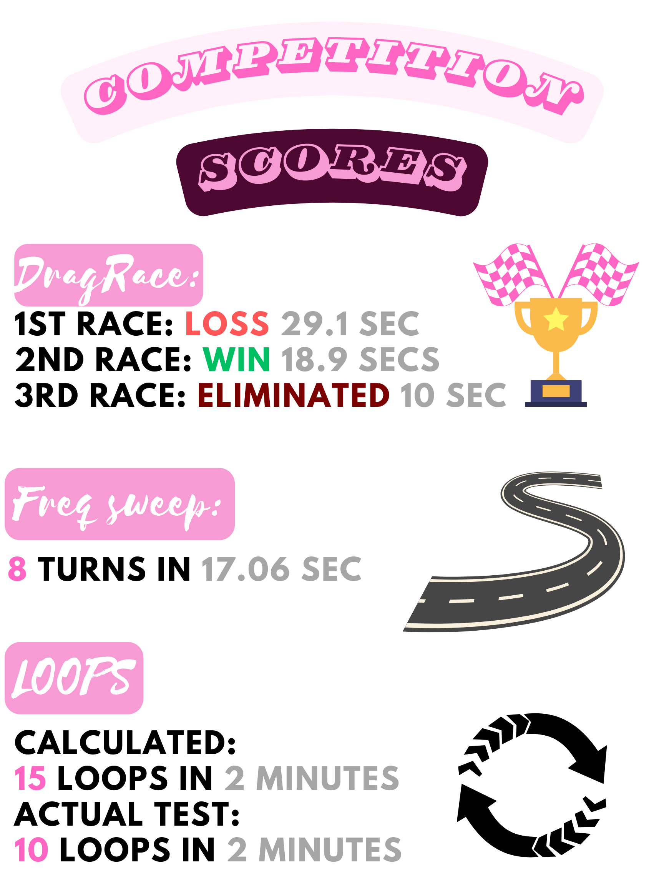

# Mark, Alex, Kaitlin, Michelle

# Making the Robot

# Failed Prototype of First Chassis
<video width="640" height="360" controls>
  <source src="FirstChassi.mp4" type="video/mp4">
  Your browser does not support the video tag.
</video>

# We All Start Somewhere

# Rocky First Steps
<video width="640" height="360" controls>
  <source src="PrototypeVid.mp4" type="video/mp4">
  Your browser does not support the video tag.
</video>

# Improvements in Progress

# New Robot Redesign

# Testing the Waters
<video width="640" height="360" controls>
  <source src="FinalRobotTest.mp4" type="video/mp4">
  Your browser does not support the video tag.
</video>

## PID Control
PID stands for Proportional-Integral-Derivative. The proportional element rapidly realigns your position when things deviate. The integral component resembles learning from wobbles over time, enabling gradual, lasting adjustments to avoid repeating errors. The derivative factor is comparable to delicately easing into a slowdown before a curve, warding off excessive speed and the potential risk of losing control. In our robot, we mainly utilized the "S" and "P" knobs on our potentiometer board to regulate speed and accuracy.

# Major SLAY PR

# Race Day!
<video width="640" height="360" controls>
  <source src="RaceDay2.mp4" type="video/mp4">
  Your browser does not support the video tag.
</video>

## Scores

