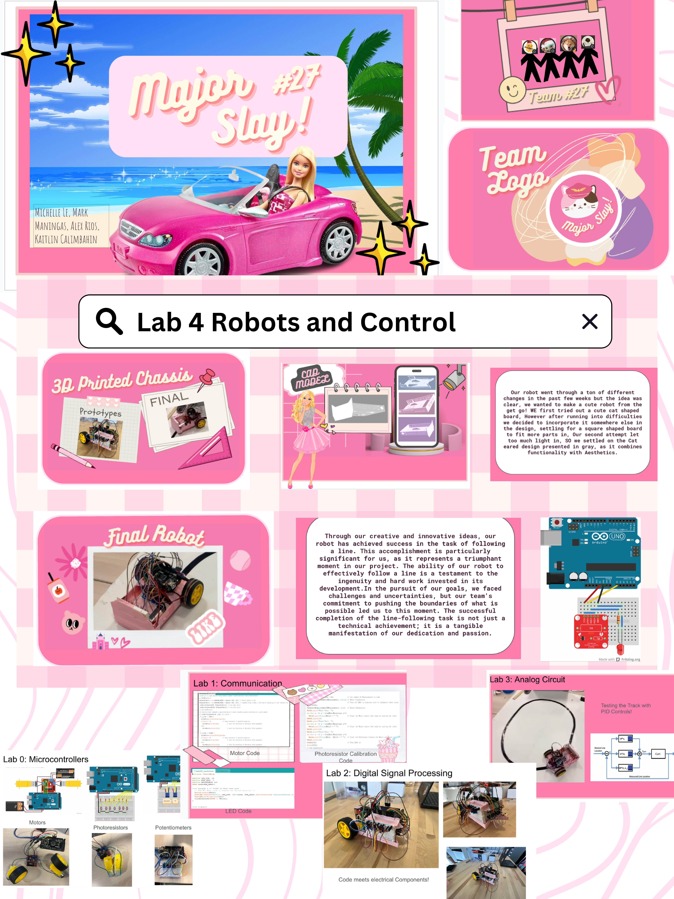

# Mark, Alex, Kaitlin, Michelle

# Making the Robot

# Failed Prototype of First Chassis
<video width="640" height="360" controls>
  <source src="FirstChassi.mp4" type="video/mp4">
  Your browser does not support the video tag.
</video>

# We All Start Somewhere

# Rocky First Steps
<video width="640" height="360" controls>
  <source src="PrototypeVid.mp4" type="video/mp4">
  Your browser does not support the video tag.
</video>

# Improvements in Progress

# New Robot Redesign

# Testing the Waters
<video width="640" height="360" controls>
  <source src="FinalRobotTest.mp4" type="video/mp4">
  Your browser does not support the video tag.
</video>

## PID Control
PID stands for Proportional-Integral-Derivative. The proportional element rapidly realigns your position when things deviate. The integral component resembles learning from wobbles over time, enabling gradual, lasting adjustments to avoid repeating errors. The derivative factor is comparable to delicately easing into a slowdown before a curve, warding off excessive speed and the potential risk of losing control. In our robot, we mainly utilized the "S" and "P" knobs on our potentiometer board to regulate speed and accuracy.

# Major SLAY PR

# Race Day!
<video width="640" height="360" controls>
  <source src="RaceDay2.mp4" type="video/mp4">
  Your browser does not support the video tag.
</video>

## Scores

# Final Thoughts 

During the last week of testing our robot, we made a few changes to the hardware and software of our robot. We noticed a lot of inconsistencies with the photoresistors so we soldered on the photoresistor circuit as well as added additional lightshields on the side of our robot. On the software side, we tested different PID values and speeds to see how our robot performed under different conditions and how to maximize the potential of our robot. If we were given more time, we would redesign the chassis so it would be more structurally stable and made entirely of plastic versus tape and popsicle sticks. We would also solder the potentiometer circuit onto a PCB board and accurately label each potentiometer. An issue we ran into was inconsistencies with the potentiometer values so we would label which direction increased or decreased its value. Lastly, more cosmetic changes such as dancing RGB LEDS and larger cat ears would have been added to our robot to increase the cute factor. 
